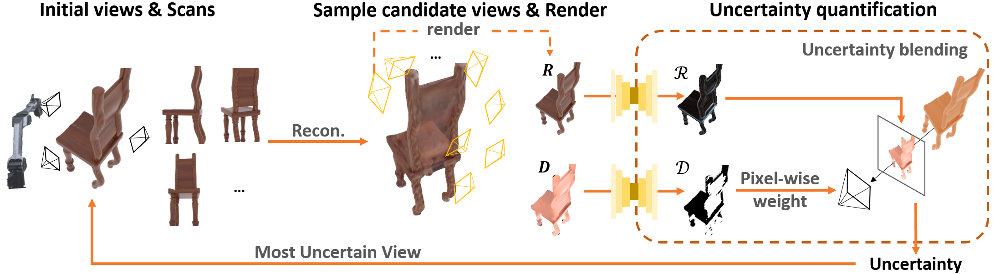

# Auto3R

Official implementation of **Auto3R: Automated 3D Reconstruction and Scanning via Data-driven Uncertainty Quantification**

**2026.4.9：we apply Auto3R on Depth-anything-3! we will update a new code for Auto3R+DA3 in this week!**

[](https://arxiv.org/abs/2512.04528)

<div align="center">
  
</div><br/>

Auto3R is an active learning framework for 3D reconstruction that automatically selects the most informative camera views using uncertainty quantification. Built on 3D Gaussian Splatting, it achieves high-quality reconstruction with fewer input views.

---

## Table of Contents
- [Requirements](#requirements)
- [Installation](#installation)
- [Pretrained Models](#pretrained-models)
- [Data Preparation](#data-preparation)
- [Usage](#usage)
- [Acknowledgements](#acknowledgements)
- [Citation](#citation)

---

## Requirements

### Hardware
- NVIDIA GPU with CUDA support (required)
- Minimum 8GB VRAM recommended

### Software
- Linux (tested on Ubuntu 20.04)
- CUDA > 11.8
- Conda or Miniconda

---

## Installation

### Step 1: Clone the Repository

```bash
git clone https://github.com/your-repo/Auto3R.git
cd Auto3R
git lfs install
git lfs pull
```

### Step 2: Create Conda Environment

```bash
conda env create -f environment.yml
conda activate auto3r
conda install -y "numpy<2"
```

This installs Python 3.10, PyTorch 2.0.1 (CUDA 11.8), torchvision, plyfile, tqdm, etc.

### Step 3: Install Additional Python Dependencies

```bash
pip install Pillow
```

`hyperiqa` is not distributed as a standard pip package. Install it from the official repository:

```bash
git clone https://github.com/SSL92/hyperIQA.git /tmp/hyperIQA
SITE_PACKAGES=$(python -c "import site; print(site.getsitepackages()[0])")
cp /tmp/hyperIQA/models.py "${SITE_PACKAGES}/hyperiqa.py"
```

### Step 4: Build and Install CUDA Extensions

The project includes three CUDA extensions in the `submodules/` directory. Build and install them:

```bash
# IMPORTANT: make CUDA toolkit match PyTorch CUDA (11.8 here)
export CUDA_HOME=/path/to/cuda-11.8
export PATH=$CUDA_HOME/bin:$PATH
nvcc --version

# Standard Gaussian rasterizer (from 3DGS)
pip install --no-build-isolation submodules/diff-gaussian-rasterization

# Modified rasterizer with depth output (from FisherRF)
pip install --no-build-isolation submodules/modified-diff-gaussian-rasterization

# Spatial KNN for point cloud initialization
pip install --no-build-isolation submodules/simple-knn
```

> **Requirements**:
> - CUDA toolkit installed (CUDA 11.8 recommended)
> - `nvcc` compiler available in PATH
> - Verify with: `nvcc --version`

### Step 5: Verify Installation

```bash
python -c "
import torch
import diff_gaussian_rasterization
import modified_diff_gaussian_rasterization
import simple_knn
from hyperiqa import HyperNet, TargetNet
print('✓ All CUDA extensions loaded successfully.')
print('Torch/CUDA:', torch.__version__, torch.version.cuda)
"
```

If you see any import errors, check that:
- CUDA toolkit version matches PyTorch CUDA version
- `nvcc` is in your PATH
- You have sufficient permissions to compile extensions

---

## Pretrained Models

Auto3R requires two pretrained models, and this repository tracks them with Git LFS. After cloning, run `git lfs pull` to fetch the actual files.

### 1. Image UQ Model

Used to assess rendered image quality.

- **Placement**: `ssimruns/scenebest.pth`

### 2. Depth UQ Model (HyperIQA)

Used to assess rendered depth map quality. We use the pretrained [HyperIQA (CVPR 2020)](https://github.com/SSL92/hyperIQA) model for this.

- **File**: `koniq_pretrained.pkl`
- **Placement**: `pretrained/koniq_pretrained.pkl`

### Verify

```bash
ls ssimruns/scenebest.pth
ls pretrained/koniq_pretrained.pkl
```

Both files must exist before running training.

---

## Data Preparation

Auto3R uses COLMAP format data (same as 3D Gaussian Splatting).

### Expected Directory Structure

```
your_dataset/
├── images/              # Input images
│   ├── 00001.jpg
│   ├── 00002.jpg
│   └── ...
└── sparse/
    └── 0/
        ├── cameras.bin
        ├── images.bin
        └── points3D.bin
```

### Processing Raw Images with COLMAP

If you are starting from raw images, run COLMAP to compute camera poses:

```bash
colmap automatic_reconstructor \
    --workspace_path /path/to/your_dataset \
    --image_path /path/to/your_dataset/images
```

Or use the provided conversion script:

```bash
python convert.py -s /path/to/your_dataset
```

---

## Usage

### Basic Run

```bash
bash scripts/demo.sh /path/to/your_dataset /path/to/output
```

Default settings:
- Initial views: 4 (selected by farthest-point sampling)
- Total views: 20 (added one at a time)
- Selection method: Hessian-based (`H_reg`)
- Iterations: 30,000

### Full Command

```bash
python active_train.py \
    -s /path/to/your_dataset \
    -m /path/to/output \
    --eval \
    --method H_reg \
    --schema v50seq4_inplace \
    --iterations 30000 \
    --seed 0 \
    --filter_out_grad rotation \
    --densify_until_iter 10000 \
    --densify_from_iter 500
```

### Key Arguments

| Argument | Description | Default |
|----------|-------------|---------|
| `-s` | Path to COLMAP dataset | required |
| `-m` | Output directory | required |
| `--method` | View selection: `H_reg` (Hessian), `rand` (random) | `rand` |
| `--schema` | Selection schedule (see below) | `all` |
| `--iterations` | Total training iterations | 30000 |
| `--seed` | Random seed | 0 |
| `--eval` | Hold out test cameras for evaluation | False |
| `--min_opacity` | Opacity threshold for Gaussian pruning | 0.005 |

### View Selection Schemas

| Schema | Init Views | Total Views | Views Added per Step |
|--------|-----------|-------------|----------------------|
| `v50seq4_inplace` | 4 | 20 | 1 |
| `v20seq1_inplace` | 4 | 20 | 1 |
| `v20seq4_inplace` | 4 | 20 | 4 |
| `v10seq1_inplace` | 2 | 10 | 1 |
| `all` | all | all | — (no active selection) |

### Output Structure

```
output/
├── point_cloud/iteration_30000/point_cloud.ply
├── iteration{N}renderuq/          # UQ maps at each selection step
│   ├── renders/
│   ├── depth/
│   └── uqs/
├── viewnumber.txt                 # Indices of selected views in order
├── cfg_args
└── chkpnt30000.pth
```

### Rendering and Evaluation

```bash
# Render novel views
python render.py -m /path/to/output

# Compute PSNR / SSIM / LPIPS on test set
python metrics.py -m /path/to/output
```

---

## Troubleshooting

**`ERROR: Could not find a version that satisfies the requirement hyperiqa`**
`hyperiqa` is not a pip package. Follow Step 3 and copy `models.py` to `site-packages/hyperiqa.py`.

**`RuntimeError: The detected CUDA version ... mismatches ... PyTorch`**
Your `nvcc` and PyTorch CUDA versions are different (e.g., `nvcc 12.x` vs `torch cu118`). Export `CUDA_HOME` and `PATH` to CUDA 11.8 before building extensions.

**`fatal error: cuda_runtime.h: No such file or directory`**
Your CUDA development headers are missing from `CUDA_HOME`. Reinstall/repair your CUDA 11.8 toolkit (including dev headers) and retry Step 4.

**`ModuleNotFoundError: No module named 'diff_gaussian_rasterization'`**
Rebuild the CUDA extensions (Step 4). Confirm `nvcc` is available and matches your PyTorch CUDA version.

**`FileNotFoundError: pretrained/koniq_pretrained.pkl`**
Run `git lfs pull` and confirm `pretrained/koniq_pretrained.pkl` exists.

**`FileNotFoundError: ssimruns/scenebest.pth`**
Run `git lfs pull` and confirm `ssimruns/scenebest.pth` exists.

**`RuntimeError: Numpy is not available`**
Your environment likely installed NumPy 2.x. Downgrade to `numpy<2`.

**`CUDA out of memory` during view selection**
Reduce the rendering batch size at `active_train.py:117` (default `B=64`).

---

## Acknowledgements

- [3D Gaussian Splatting](https://github.com/graphdeco-inria/gaussian-splatting)
- [HyperIQA](https://github.com/SSL92/hyperIQA)

---

## Citation

```bibtex
@misc{shen2025auto3rautomated3dreconstruction,
      title={Auto3R: Automated 3D Reconstruction and Scanning via Data-driven Uncertainty Quantification},
      author={Chentao Shen and Sizhe Zheng and Bingqian Wu and Yaohua Feng and Yuanchen Fei and Mingyu Mei and Hanwen Jiang and Xiangru Huang},
      year={2025},
      eprint={2512.04528},
      archivePrefix={arXiv},
      primaryClass={cs.CV},
      url={https://arxiv.org/abs/2512.04528},
}
```
